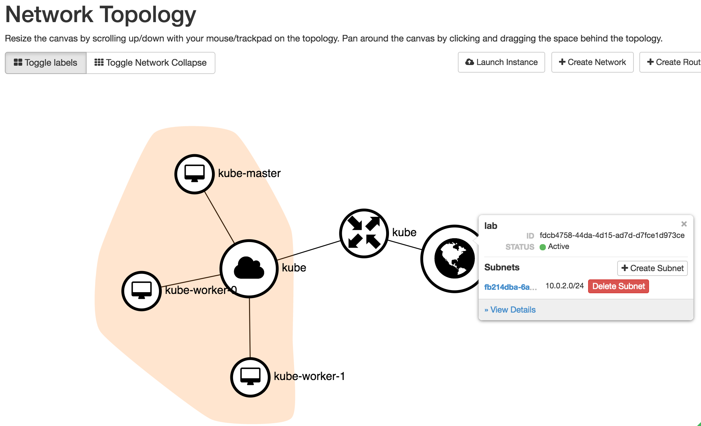

# Terraform Your Kubernetes Cluster on OpenStack with Kubeadm

This repo provides the bootstrap scripts to create a Kubernetes development cluster on an OpenStack cloud with the [`kubeadm`](http://kubernetes.io/docs/getting-started-guides/kubeadm/) tool.

It has been written to minimize dependencies -- you will only needs to install [terraform](http://terraform.hashicorp.com), this repo and `kubectl` on your laptop to get a fully functional cluster running.

## What Does This Do ?

At the conclusion of the scripts, you will have one Kubernetes master node and _x_ Kubernetes worker nodes. In your OpenStack Horizon dashboard you will see this (_where x == 2 worker nodes_):



As you can see, Terraform has created the following in your OpenStack cloud:

* One VM instance for the Kubernetes Master node
* One floating / public IP address for the Kubernetes Master node
* Two (configurable number) VM instances for the Kubernetes Workers nodes
* Tenant/project network and subnet
* Tenant/project router that connects to provide network/internet

It has also configured the following on that OpenStack infrastructure:

* Installed Kubernetes master node on `kube-master` via `kubeadm init`
* Installs and registers a variable number of worker nodes with Kubernetes software with `kubeadm join`
* Configures new Kubernetes cluster with [Weave networking](http://weave.com)
* Writes and retrieves `kubectl` configuration file
* Installs KubeDNS, Kubernetes Dashboard and WeaveScope add-ons **LINKS**
* Sets up easy aliases for usage of new cluster

Logically, your new Kubernetes cluster now looks like this (using the installed WeaveScope tool):


## What Does This NOT Do ?

* High availability control plane
* High availability `etcd` cluster
* Host on any other cloud than OpenStack
* Host on any other operating system than Ubuntu 16.04 LTS
* (YET) Setup OpenStack cloud provider specific options (persistent storage, load balancer)

# Cluster Creation

Choose your own adventure below, depending on your level of impulse control.

## For The impatient

```
$ brew install kubectl terraform jq
$ curl -o tf.zip https://github.com/slashk/terra-kubeadm-on-os/archive/master.zip
$ unzip tf.zip
$ cd terra-kubeadm-on-os-master
$ cp sample.tfvars terraform.tfvars
$ vi terraform.tfvars
$ terraform plan
$ terraform apply
$ ./post-install.sh
$ source ./commands.alias
```

These lines:

* Sets your default variables (using the sample.tfvars file that you edited)
* installs `terraform` to create your infrastructure and `kubectl` to control your cluster
* downloads and unzips this repo for the terraform scripts
* runs terraform plan (preflight) then terraform apply to create the OpenStack infrastructure for the cluster (this will take a while -- five minutes on my cloud)
* executes a small bash script to setup your local laptop and twiddles some server settings to communicate with the new cluster
* sources some convienence commands to make it easy to **REWORK**  

## For The More Thoughtful

See this blog post

## FAQ

### What if I want my Kubernetes cluster on another cloud ?

Use another tool:

* [Kops](https://github.com/kubernetes/kops) for AWS
* [Google Container Enginer (GKE)](https://cloud.google.com/container-engine/) on Google Cloud
* [Azure Container Service](https://azure.microsoft.com/en-us/services/container-service/) on Microsoft Azure

### What if I want a Kubernetes cluster on my laptop ?

[Minikube](https://github.com/kubernetes/minikube) is your boy. I use it [with the xhyve driver](https://github.com/kubernetes/minikube/blob/master/DRIVERS.md#xhyve-driver) on my Mac.
